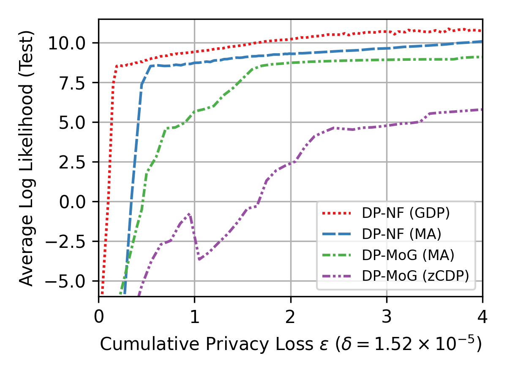
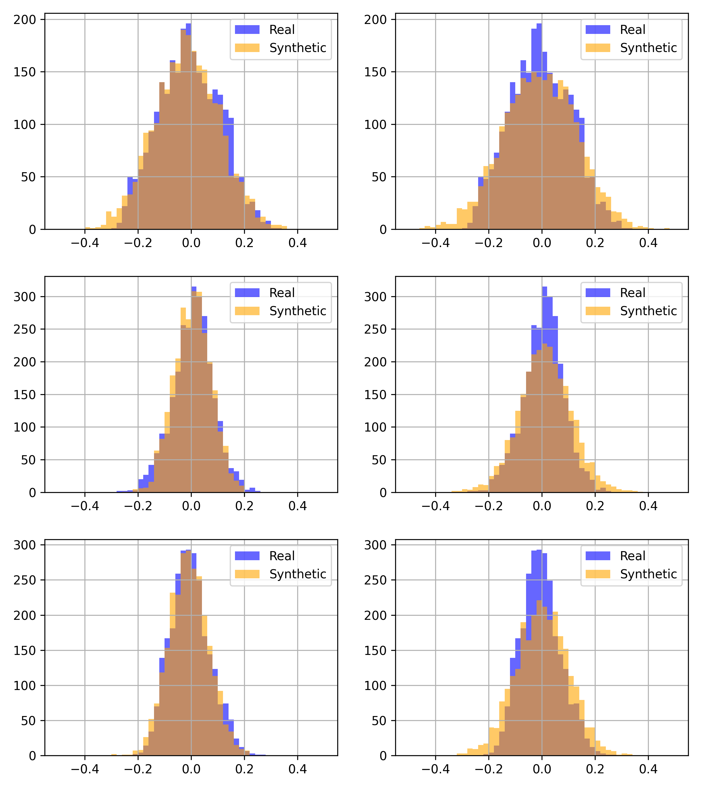
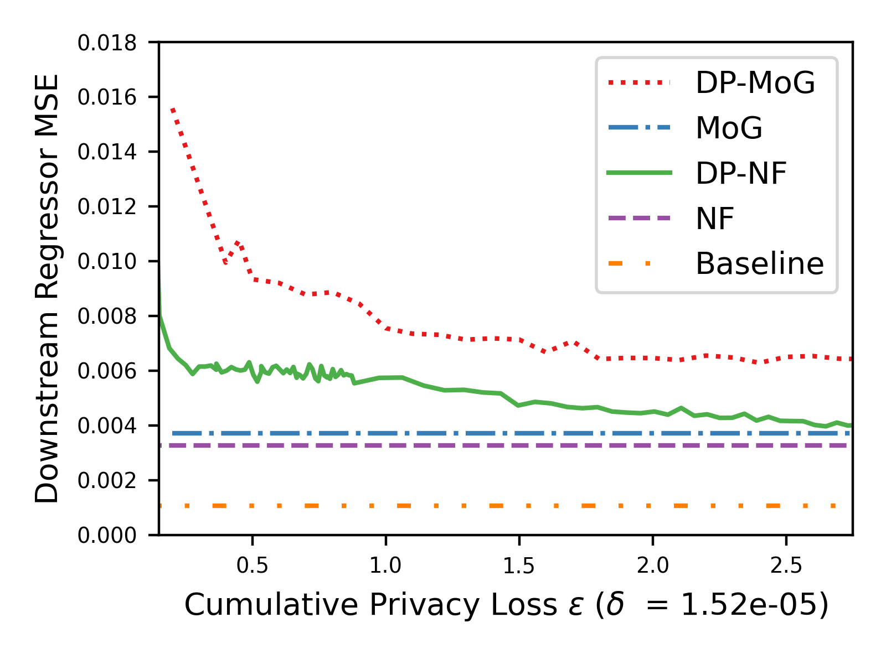

# Differentially Private Normalizing Flows for Privacy-Preserving Density Estimation

## Requirements

To install requirements (using conda):

```setup
conda env create -f environment.yml
```

If you prefer vanilla Python, install Python 3.7.7 and install dependencies via:

```
pip install -r requirements.txt
```

This repository relies heavily on the JAX deep learning framework. The dependencies include a default installation prepared for CPU, but if you would like to run things on GPU, refer to the [JAX installation guide](https://github.com/google/jax#installation) for installing an appropriate version for your machine. The command you run will probably look something like this, but it will be platform specific:

```
pip install --upgrade https://storage.googleapis.com/jax-releases/cuda102/jaxlib-0.1.47-cp37-none-linux_x86_64.whl
```

## Pretrained Models

Note: you will need to download this file regardless even if you intend to retrain the models to get the expriment configs. Note that all model training is seeded for reproducibility.

**Make sure to download pretrained models and experiment configurations [here](https://drive.google.com/file/d/1CipD-FupRRz-bYcvgh0ZfcVkAupfH9Kw/view?usp=sharing), even if you intend to retrain the models. Place it in the `flows/research/dp-flows` directory as `out/`.**

## Retraining Models

```
cp out/lifesci/flows/private-kfold-10/experiment.ini .
python train.py
```

## Main Results

### Main Paper

#### Figure 2



To reproduce:

`python analysis/figure_2.py`

Output file will then be placed as `analysis/figure_2.png`.

#### Figure 3



To reproduce:

`python analysis/figure_3.py`

Dimension-wise plots will then be output within each iteration directory under `out/`, e.g., `out/lifesci/flows/private-kfold-10/0/ITERATION/DIM.png`.

To convert iterations to epsilons, simply run `analysis/print_likelihoods.py`.

#### Figure 7



To reproduce:

`python analysis/figure_7.py`

